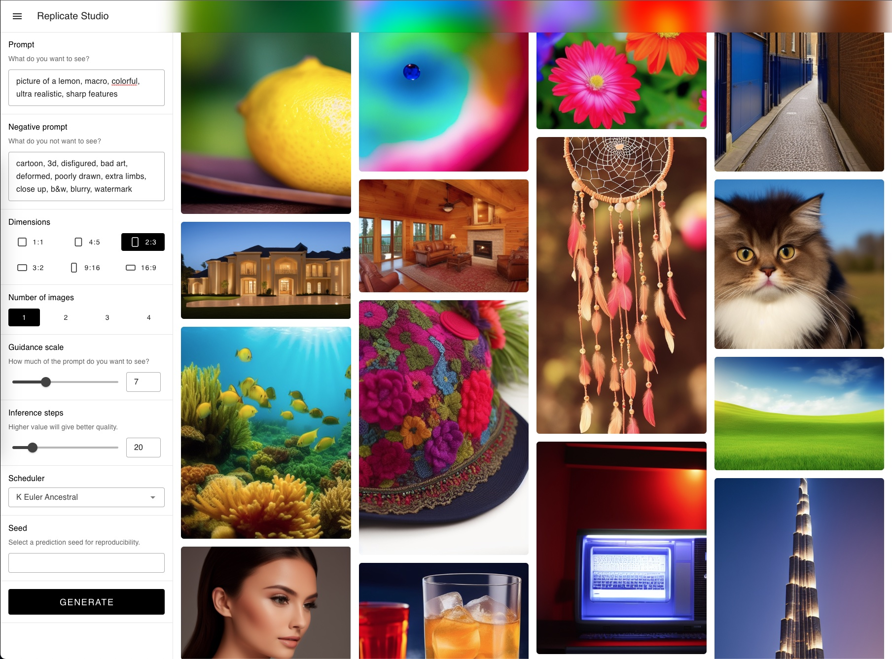

# Replicate Studio

AI art studio powered by [Replicate](https://replicate.com/).



## Setup

Install dependencies:

```bash
npm install
```

Create a `.env` file and add your [Replicate API token](https://replicate.com/account/api-tokens) to it:

```
NUXT_REPLICATE_API_KEY=r8_xxxxxxxxxxxxxxxxxxxxxxxxxxxxxx
```

Start the studio on `http://localhost:3000`:

```bash
npm run dev
```
